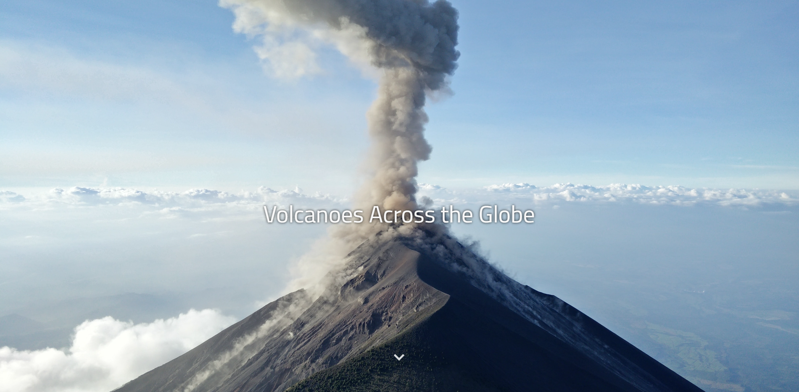

# Volcanoes Around the globe
## About
This storymap is about volcano eruptions on Earth. The storymap takes a look at four of many significant eruptions throughout time.

Here is the storymap: https://igarcia8.github.io/volcanic-eruptions-storymap/

### Goal
The goal of this project is to educate the general public about volcanoes. This is an introduction to volcanoes that can be used to call attention to the importance of volcanic monitoring.

## Data Sources
* The volcanic locational json data is sourced from the [Humanitarian Data Exchange](https://data.humdata.org/dataset/a60ac839-920d-435a-bf7d-25855602699d/resource/7234d067-2d74-449a-9c61-22ae6d98d928)
* The supporting facts are sourced from !Live Science](livescience.com) and the [United States Geological Survey](usgs.gov)
* Images from [Unsplash](Unsplash.com) , and other sources located in the excel file
* The map and icon used are from [Mapbox](mapbox.com)

## Applied libraries

Leaflet
* https://cdnjs.cloudflare.com/ajax/libs/leaflet/1.4.0/leaflet.js

JQuery
* https://cdnjs.cloudflare.com/ajax/libs/jquery/3.2.1/jquery.min.js
* https://cdnjs.cloudflare.com/ajax/libs/popper.js/1.14.0/umd/popper.min.js

Bootstrap
* https://maxcdn.bootstrapcdn.com/bootstrap/4.3.1/js/bootstrap.min.js
<!--leaflet.ajax for asynchronously adding geojson data-->
* https://cdnjs.cloudflare.com/ajax/libs/leaflet-ajax/2.1.0/leaflet.ajax.min.js

Mini Globle Map
* https://cdnjs.cloudflare.com/ajax/libs/d3/3.5.5/d3.min.js
* https://cdnjs.cloudflare.com/ajax/libs/topojson/1.6.19/topojson.min.js

## Acknowledgements
Thanks to [Bo Zhao](https://github.com/jakobzhao) for the storymap [template](https://github.com/jakobzhao/storymap-test)
